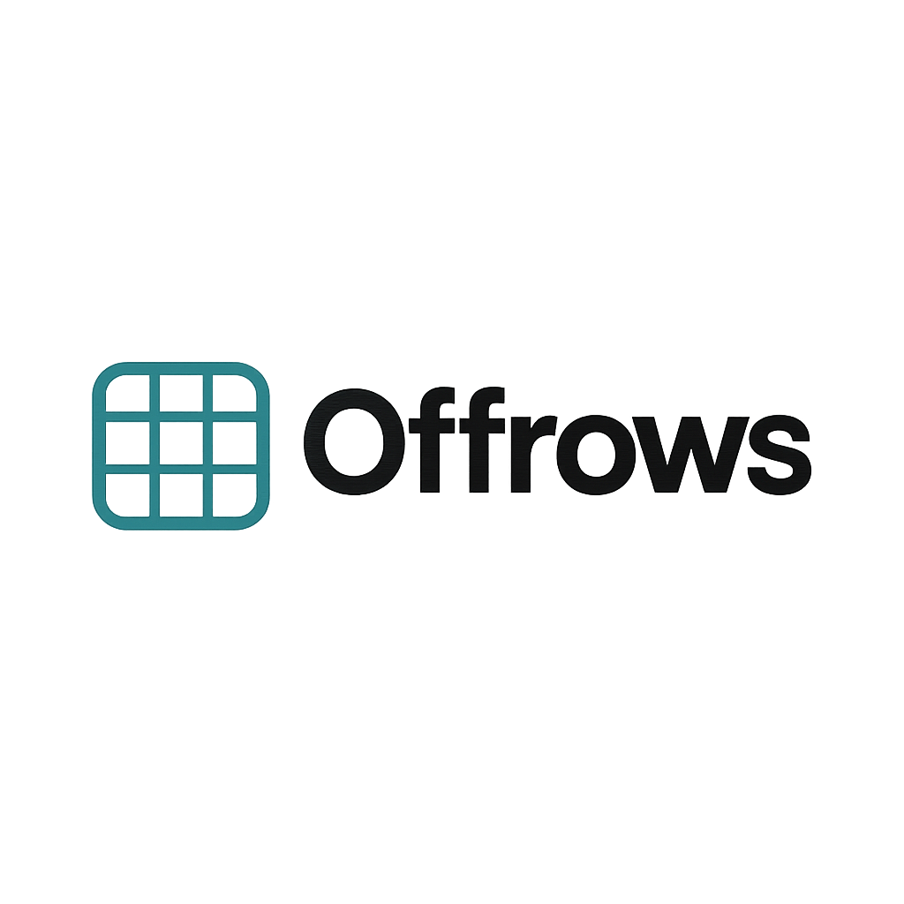

# Offrows - Modern Offline-First Spreadsheet & Database Platform

<div align="center">
  
  
  <p align="center">
    <strong>Empowering data management where connectivity matters</strong>
  </p>
  
  <p align="center">
    A powerful, offline-first alternative to Airtable and Google Sheets, built specifically for users in regions with limited internet connectivity.
  </p>

  <p align="center">
    <a href="#-quick-start">Quick Start</a> •
    <a href="#-features">Features</a> •
    <a href="#-architecture">Architecture</a> •
    <a href="#-contributing">Contributing</a> •
    <a href="#-support">Support</a>
  </p>

  <p align="center">
    
    
    
    
  </p>
</div>

---

## 🌟 Overview

Offrows bridges the digital divide by providing a complete data management solution that works seamlessly offline. Built with modern web technologies, it offers the familiar spreadsheet interface users love, combined with robust database capabilities—all without requiring constant internet connectivity.

### Why Offrows?

In regions like Myanmar and other areas with unreliable internet infrastructure, traditional cloud-based tools become barriers rather than solutions. Offrows ensures your data work never stops, whether you're connected or not.

## 🚀 Quick Start

```bash
# Clone the repository
git clone https://github.com/janakhpon/off-rows.git
cd off-rows

# Install dependencies
npm install

# Start development server
npm run dev
```

Open [http://localhost:3000](http://localhost:3000) to see Offrows in action.


## 📊 Supported Data Types

| Type | Description | Features |
|------|-------------|----------|
| **Text** | Simple text input | Searchable, filterable |
| **Number** | Numeric values | Validation, formatting |
| **Date** | Date picker | Calendar interface |
| **Boolean** | True/False values | Checkbox interface |
| **Dropdown** | Select from options | Predefined choices |
| **Image** | Single image upload | Preview, compression |
| **Images** | Multiple images | Gallery view |
| **File** | Single file upload | Type validation |
| **Files** | Multiple files | Bulk operations |

## 🔄 Offline Functionality

### How It Works
1. **Route Precaching**: All pages cached for instant offline access
2. **Service Worker**: Handles caching strategies and fallbacks
3. **IndexedDB**: Stores all data locally with automatic sync
4. **Progressive Enhancement**: Enhanced experience offline


## 🛠️ Development

### Prerequisites
- Node.js 22+
- npm or yarn

### Available Scripts

```bash
npm run dev          # Start development server
npm run build:local  # Build with WASM support
npm run build        # Production build
npm run start        # Start production server
npm run lint         # Run ESLint
npm run type-check   # TypeScript validation
```

### Environment Configuration

Create `.env.local` for local development:

```env
# Optional: Analytics tracking
NEXT_PUBLIC_ANALYTICS_ID=your-analytics-id

# Optional: Custom domain
NEXT_PUBLIC_SITE_URL=https://yourdomain.com
```


### 🤝 **Get Involved**

Want to help shape the future of Offrows? We'd love your input:
- **Feature requests**: Share your ideas in [GitHub Discussions](https://github.com/janakhpon/off-rows/discussions)
- **Technical contributions**: Check our [contribution guidelines](CONTRIBUTING.md)
- **User feedback**: Tell us about your use cases and challenges
- **Community building**: Help us reach users in connectivity-challenged regions

## 🤝 Contributing

We welcome contributions from developers around the world! Please see our [Contributing Guide](CONTRIBUTING.md) for detailed information.

### Getting Started
1. Fork the repository
2. Create a feature branch (`git checkout -b feature/amazing-feature`)
3. Commit your changes (`git commit -m 'Add amazing feature'`)
4. Push to the branch (`git push origin feature/amazing-feature`)
5. Open a Pull Request

### Code Standards
- Use TypeScript for all new code
- Follow existing component patterns
- Use Tailwind CSS for styling
- Write meaningful commit messages
- Add tests for new features

## 📄 License

**Offrows Community License**

Offrows is free for personal, educational, and non-commercial use. Our licensing model ensures the project remains accessible to those who need it most while protecting the integrity of our mission.


### 🌍 **Our Philosophy**
We believe in keeping Offrows free for the communities that need it most—especially in regions with limited resources and connectivity. Our licensing ensures the project remains sustainable while preventing exploitation.


## 🙏 Acknowledgments

- [Next.js](https://nextjs.org/) - React framework
- [Tailwind CSS](https://tailwindcss.com/) - Utility-first CSS
- [Lucide](https://lucide.dev/) - Beautiful icons
- [next-pwa](https://github.com/DuCanhGH/next-pwa) - PWA support

## 📞 Support

- **🐛 Bug Reports**: [GitHub Issues](https://github.com/janakhpon/off-rows/issues)
- **💬 Discussions**: [GitHub Discussions](https://github.com/janakhpon/off-rows/discussions)
- **📖 Documentation**: [Wiki](https://github.com/janakhpon/off-rows/wiki)

---

<div align="center">
  <p>
    <strong>Offrows</strong> - Empowering communities through accessible, offline-first data management
  </p>
  <p>
    Made with ❤️ for users in regions with limited connectivity
  </p>
</div>