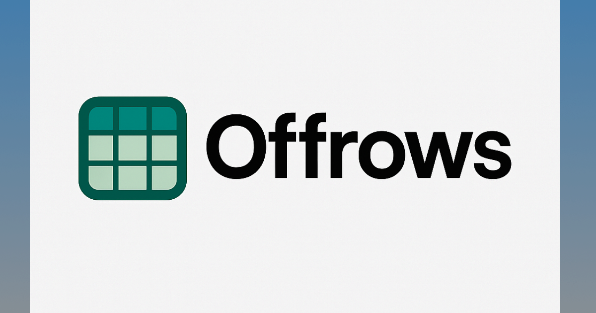

# Offrows - Modern Offline-First Spreadsheet & Database Platform

<div align="center">
  
  
  <p align="center">
    <strong>Empowering data management where connectivity matters</strong>
  </p>
  
  <p align="center">
    A powerful, offline-first alternative to Airtable and Google Sheets, built specifically for users in regions with limited internet connectivity.
  </p>

  <p align="center">
    <a href="#-quick-start">Quick Start</a> •
    <a href="#-features">Features</a> •
    <a href="#-architecture">Architecture</a> •
    <a href="#-contributing">Contributing</a> •
    <a href="#-support">Support</a>
  </p>

  <p align="center">
    
    
    
    
  </p>
</div>

---

## 🌟 Overview

Offrows bridges the digital divide by providing a complete data management solution that works seamlessly offline. Built with modern web technologies, it offers the familiar spreadsheet interface users love, combined with robust database capabilities—all without requiring constant internet connectivity.

### Why Offrows?

In regions like Myanmar and other areas with unreliable internet infrastructure, traditional cloud-based tools become barriers rather than solutions. Offrows ensures your data work never stops, whether you're connected or not.

## 🚀 Quick Start

```bash
# Clone the repository
git clone https://github.com/janakhpon/off-rows.git
cd off-rows

# Install dependencies
npm install

# Start development server
npm run dev
```

Open [http://localhost:3000](http://localhost:3000) to see Offrows in action.

## ✨ Features

### 🔄 True Offline-First Design
- **Complete offline functionality** with IndexedDB storage
- **Seamless synchronization** when connectivity returns
- **Zero data loss** with robust local persistence

### 📊 Powerful Data Management
- **Excel-like interface** with real-time editing
- **Multiple data types**: Text, Number, Date, Boolean, Dropdown, Images, Files
- **Advanced search & filtering** across all data
- **CSV/JSON import/export** capabilities

### 📱 Progressive Web App (PWA)
- **Installable** on any device (mobile, tablet, desktop)
- **App-like experience** with native functionality
- **Automatic caching** and background updates
- **Push notifications** for important updates

### 🎨 Modern User Experience
- **Responsive design** that works on all screen sizes
- **Dark/Light themes** with automatic switching
- **Smooth animations** and intuitive interactions
- **Full keyboard navigation** for power users

### 🔧 Technical Excellence
- **TypeScript** for type safety and reliability
- **Next.js 15** with App Router for performance
- **Static generation** for lightning-fast loading
- **Service Worker** for robust offline capabilities

## 🏗️ Architecture

### Technology Stack

| Category | Technologies |
|----------|-------------|
| **Frontend** | Next.js 15, React 18, TypeScript |
| **Styling** | Tailwind CSS, CSS Custom Properties |
| **State Management** | Zustand, React Context |
| **Database** | IndexedDB with Dexie.js |
| **PWA** | next-pwa, Service Workers |
| **Validation** | Zod schemas |

### Project Structure

```
off-rows/
├── src/
│   ├── app/                    # Next.js App Router
│   │   ├── contexts/          # React contexts
│   │   ├── layout.tsx         # Root layout with PWA
│   │   └── page.tsx           # Main application
│   ├── components/            # React components
│   │   ├── ui/               # Reusable UI components
│   │   ├── layout/           # Layout components
│   │   ├── data-grid/        # Data grid system
│   │   └── modals/           # Modal dialogs
│   └── lib/                  # Core utilities
│       ├── database.ts       # IndexedDB operations
│       ├── offline.ts        # Offline utilities
│       ├── schemas.ts        # Data validation
│       └── store.ts          # State management
├── public/                   # Static assets
│   ├── manifest.json         # PWA manifest
│   └── icons/               # App icons
└── next.config.ts           # Next.js configuration
```

## 📊 Supported Data Types

| Type | Description | Features |
|------|-------------|----------|
| **Text** | Simple text input | Searchable, filterable |
| **Number** | Numeric values | Validation, formatting |
| **Date** | Date picker | Calendar interface |
| **Boolean** | True/False values | Checkbox interface |
| **Dropdown** | Select from options | Predefined choices |
| **Image** | Single image upload | Preview, compression |
| **Images** | Multiple images | Gallery view |
| **File** | Single file upload | Type validation |
| **Files** | Multiple files | Bulk operations |

## 🔄 Offline Functionality

### How It Works
1. **Route Precaching**: All pages cached for instant offline access
2. **Service Worker**: Handles caching strategies and fallbacks
3. **IndexedDB**: Stores all data locally with automatic sync
4. **Progressive Enhancement**: Enhanced experience offline

### Testing Offline Mode
1. Load the app online to cache resources
2. Disconnect internet or use DevTools offline mode
3. Navigate and edit data - everything works seamlessly
4. Reconnect - data syncs automatically

## 🛠️ Development

### Prerequisites
- Node.js 22+
- npm or yarn

### Available Scripts

```bash
npm run dev          # Start development server
npm run build:local  # Build with WASM support
npm run build        # Production build
npm run start        # Start production server
npm run lint         # Run ESLint
npm run type-check   # TypeScript validation
```

### Environment Configuration

Create `.env.local` for local development:

```env
# Optional: Analytics tracking
NEXT_PUBLIC_ANALYTICS_ID=your-analytics-id

# Optional: Custom domain
NEXT_PUBLIC_SITE_URL=https://yourdomain.com
```

## 🧪 Testing & Browser Support

### Manual Testing Checklist
- ✅ Online functionality with all features
- ✅ Offline mode with full capability
- ✅ PWA installation process
- ✅ Data persistence across sessions
- ✅ File upload/download operations

### Browser Compatibility
- ✅ Chrome/Chromium (recommended)
- ✅ Firefox
- ✅ Safari
- ✅ Microsoft Edge

## 🗺️ Roadmap & Next Steps

We're continuously evolving Offrows to meet the needs of our global community. Here's what's coming next:

### 🚀 Upcoming Features

#### 🦀 **WASM + Rust Image Processing**
- **High-performance image manipulation** with WebAssembly
- **Client-side image compression** and optimization
- **Advanced filters and transformations** without server dependency
- **Batch processing** for multiple images offline

#### 🔒 **End-to-End Encryption**
- **Zero-knowledge architecture** - your data stays private
- **Client-side encryption** before any data leaves your device
- **Secure key management** with user-controlled keys
- **Encrypted sync** for secure collaboration

#### ☁️ **Hybrid Online/Offline Architecture**
- **Optional cloud sync** for users with reliable connectivity
- **Smart sync strategies** - sync only when beneficial
- **Conflict resolution** with user-friendly merge tools
- **Selective sync** - choose what data to sync

#### 🔄 **Seamless Database Synchronization**
- **Multi-database support**: Supabase, PostgreSQL, MySQL
- **Real-time sync** with conflict detection
- **Bidirectional sync** between IndexedDB and cloud databases
- **Offline-first, online-enhanced** data flow
- **Schema migration** and version management

#### 🌐 **Enhanced Collaboration**
- **Multi-user editing** with operational transforms
- **Permission management** and access controls
- **Activity feeds** and change tracking
- **Comments and annotations** on data entries

#### 📊 **Advanced Analytics**
- **Built-in charts** and visualization tools
- **Data export** to business intelligence tools
- **Automated reporting** with scheduled exports
- **Custom dashboards** for data insights

### 🎯 **Long-term Vision**

- **Plugin ecosystem** for custom data types and processors
- **Mobile-first native apps** for iOS and Android
- **Distributed peer-to-peer sync** for truly decentralized data
- **AI-powered data insights** and automated categorization
- **Multi-language support** for global accessibility

### 🤝 **Get Involved**

Want to help shape the future of Offrows? We'd love your input:
- **Feature requests**: Share your ideas in [GitHub Discussions](https://github.com/janakhpon/off-rows/discussions)
- **Technical contributions**: Check our [contribution guidelines](CONTRIBUTING.md)
- **User feedback**: Tell us about your use cases and challenges
- **Community building**: Help us reach users in connectivity-challenged regions

## 🤝 Contributing

We welcome contributions from developers around the world! Please see our [Contributing Guide](CONTRIBUTING.md) for detailed information.

### Getting Started
1. Fork the repository
2. Create a feature branch (`git checkout -b feature/amazing-feature`)
3. Commit your changes (`git commit -m 'Add amazing feature'`)
4. Push to the branch (`git push origin feature/amazing-feature`)
5. Open a Pull Request

### Code Standards
- Use TypeScript for all new code
- Follow existing component patterns
- Use Tailwind CSS for styling
- Write meaningful commit messages
- Add tests for new features

## 📄 License

**Offrows Community License**

Offrows is free for personal, educational, and non-commercial use. Our licensing model ensures the project remains accessible to those who need it most while protecting the integrity of our mission.

### ✅ **What's Permitted**
- **Personal use** - Use Offrows for your own data management needs
- **Educational use** - Use in schools, universities, and training programs
- **Non-profit organizations** - Use for charitable and community purposes
- **Contributing back** - Submit improvements and bug fixes to the main project
- **Studying the code** - Learn from and reference our implementation

### ❌ **What's Not Permitted**
- **Commercial redistribution** - Selling or licensing Offrows under a different name
- **Rebranding** - Removing Offrows branding or claiming it as your own work
- **Derivative commercial products** - Creating competing products based on our code
- **Closed-source modifications** - Distributing modified versions without sharing source

### 🤝 **Commercial Use**
For commercial use, enterprise deployments, or if you want to create derivative products, please contact us at [licensing@offrows.org](mailto:licensing@offrows.org) to discuss licensing options.

### 🌍 **Our Philosophy**
We believe in keeping Offrows free for the communities that need it most—especially in regions with limited resources and connectivity. Our licensing ensures the project remains sustainable while preventing exploitation.

**Note**: This is a summary of our licensing terms. Please see the full [LICENSE](LICENSE) file for complete legal details.

## 🙏 Acknowledgments

- [Next.js](https://nextjs.org/) - React framework
- [Tailwind CSS](https://tailwindcss.com/) - Utility-first CSS
- [Lucide](https://lucide.dev/) - Beautiful icons
- [next-pwa](https://github.com/DuCanhGH/next-pwa) - PWA support

## 📞 Support

- **🐛 Bug Reports**: [GitHub Issues](https://github.com/janakhpon/off-rows/issues)
- **💬 Discussions**: [GitHub Discussions](https://github.com/janakhpon/off-rows/discussions)
- **📖 Documentation**: [Wiki](https://github.com/janakhpon/off-rows/wiki)

---

<div align="center">
  <p>
    <strong>Offrows</strong> - Empowering communities through accessible, offline-first data management
  </p>
  <p>
    Made with ❤️ for users in regions with limited connectivity
  </p>
</div>